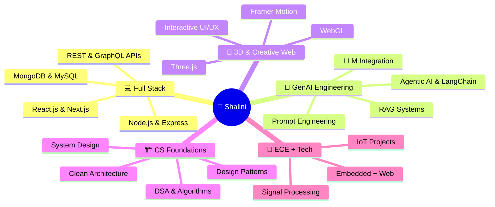

<div align="center">

<!-- Animated Header Banner -->


<!-- Animated Floating Name Effect -->
<br/>

<!-- Typing SVG - Multiple Roles -->
<a href="https://git.io/typing-svg">
  
</a>

<br/><br/>

<!-- Animated Badges Row -->
<p>
  
  &nbsp;
  
  &nbsp;
  
  &nbsp;
  
</p>

<!-- Animated Tech Badges -->
<p>
  
  
  
  
  
  
  
  
</p>

</div>

---

<!-- About Section -->


## 🌟 About Me

```yaml
╔══════════════════════════════════════════╗
  👩‍💻  DEVELOPER PROFILE
╚══════════════════════════════════════════╝

name          : Shalini Chaurasiya
location      : Basti, Uttar Pradesh, India 🇮🇳
education     : B.Tech — Electronics & Communication Engg.
university    : [Current Institution]
cgpa          : [Your CGPA] ⭐
status        : 🟢 Actively building & open to opportunities

currently_building:
  🤖  InterviewAI.IQ  — AI Mock Interview Platform
  🏥  MediTracker     — AI-powered Health Management App

skills_sharpening:
  ⚡  MERN Full Stack  &  REST API Design
  🧠  Agentic AI, LLM Integration, RAG Systems
  🎮  Three.js, WebGL, 3D Web Experiences
  🏗️  System Design, DSA & Clean Architecture

interests:
  💜  Generative AI & Prompt Engineering
  🌐  Full Stack Web Development
  🔬  ECE + CS intersection projects
  🧩  Problem Solving & Open Source

motto : "Turn wild ideas into interactive digital reality ✨"
```

<br clear="right"/>

---

## 🧠 What I'm Working On

<table>
<tr>
<td width="50%">

### 🔭 Currently Building
- 🤖 **InterviewAI.IQ** — LLM-powered mock interview system with real-time feedback
- 🏥 **MediTracker** — MERN + AI health management platform
- 🛒 **E-Commerce UI** — React + Tailwind responsive storefront

</td>
<td width="50%">

### 📚 Currently Learning
- 🧠 Agentic AI Workflows & LangChain
- 🌐 Next.js 14 App Router & Server Components
- 🎨 Three.js & WebGL for 3D web
- 🏗️ System Design & Scalable Architecture

</td>
</tr>
</table>

---

## 🛠️ Tech Arsenal

<div align="center">

### 💻 Languages
<p>
  
</p>

### 🎨 Frontend & Frameworks
<p>
  
</p>

### ⚙️ Backend & Databases
<p>
  
</p>

### 🔧 Tools, Platforms & DevOps
<p>
  
</p>

### 🤖 AI / GenAI Stack
<p>
  
  
  
  
  
  
</p>

</div>

---

## 🚀 Featured Projects

<div align="center">

<a href="https://github.com/Shalini-chaurasiya/InterviweAI.IQ">
  
</a>
<a href="https://github.com/Shalini-chaurasiya/MediTracker">
  
</a>

</div>

<br/>

<details open>
<summary><b>🔹 InterviewAI.IQ — AI-Powered Mock Interview Platform</b></summary>

<br/>

> 🎯 **Transform how developers prepare for technical interviews using AI**

| Feature | Description |
|---|---|
| 🤖 LLM Agent Engine | Dynamic question generation based on role & seniority level |
| 📊 Real-time Analytics | Performance scoring, gap analysis & improvement roadmap |
| 🎙️ Voice + Text Mode | Multi-modal interview simulation experience |
| 🗂️ Interview Tracks | Frontend, Backend, DSA, System Design, Behavioral |
| 📈 Progress Dashboard | Historical trends, strengths & weak spot detection |

**Tech Stack:**
`React.js` `Node.js` `Express.js` `MongoDB` `GenAI APIs` `LLM Agents` `REST APIs` `JWT Auth`

</details>

<br/>

<details open>
<summary><b>🔹 MediTracker — AI-Powered Health Management System</b></summary>

<br/>

> 🏥 **Your intelligent personal health companion**

| Feature | Description |
|---|---|
| 💊 Med Tracker | Smart medication schedule & reminder system |
| 🔍 AI Health Insights | Agent-driven health analysis & personalized recommendations |
| 📋 Medical Records | Organized digital health history & reports |
| 🔔 Smart Reminders | Context-aware notification engine |

**Tech Stack:**
`MongoDB` `Express.js` `React.js` `Node.js` `Python` `AI Agent` `REST APIs`

</details>

<br/>

<details>
<summary><b>🔹 E-Commerce Platform — React.js + Tailwind CSS</b></summary>

<br/>

> 🛒 **Modern, elegant shopping experience**

| Feature | Description |
|---|---|
| 🛍️ Product Management | Dynamic catalog with filters & search |
| 🛒 Cart System | Persistent cart with quantity management |
| 📱 Responsive Design | Pixel-perfect across all screen sizes |
| ⚡ Performance | Optimized with React hooks & lazy loading |

**Tech Stack:**
`React.js` `Tailwind CSS` `JavaScript` `React Hooks` `Context API`

</details>

---

## 📊 GitHub Analytics

<div align="center">


<br/>


&nbsp;&nbsp;


</div>

---

## 🏆 GitHub Trophies

<div align="center">
  
</div>

---

## 🎯 Learning Roadmap & Focus Areas



---

## 📅 Coding Activity

<div align="center">
  
</div>

---

## 💡 Dev Philosophy

<div align="center">

<table>
<tr>
<td align="center" width="25%">
  <br/>
  <b>🧠 Think First</b><br/>
  <sub>Design before you code.<br/>Architecture > speed.</sub>
</td>
<td align="center" width="25%">
  <br/>
  <b>🔁 Iterate Fast</b><br/>
  <sub>Ship early, refine often.<br/>Progress over perfection.</sub>
</td>
<td align="center" width="25%">
  <br/>
  <b>🤝 Collaborate</b><br/>
  <sub>Open source. Pair up.<br/>Grow together.</sub>
</td>
<td align="center" width="25%">
  <br/>
  <b>📚 Learn Daily</b><br/>
  <sub>One new thing every day.<br/>Compound growth.</sub>
</td>
</tr>
</table>

</div>

---

## 🤝 Let's Connect & Collaborate!

<div align="center">

<a href="https://www.linkedin.com/in/shalini-chaurasiya-03425931a/" target="_blank">
  
</a>
&nbsp;
<a href="mailto:shalinichaurasiya2203@gmail.com">
  
</a>
&nbsp;
<a href="https://github.com/Shalini-chaurasiya" target="_blank">
  
</a>

<br/><br/>

<!-- Animated Quote -->


<br/><br/>

<!-- Animated Visitor Counter -->


</div>

---

<div align="center">


### 💜 Thanks for visiting my profile!

**If you like what you see, consider giving a ⭐ to my repos — it means a lot!**

> *"First, solve the problem. Then, write the code."* — John Johnson

<br/>

<!-- Animated Footer Wave -->


</div>
