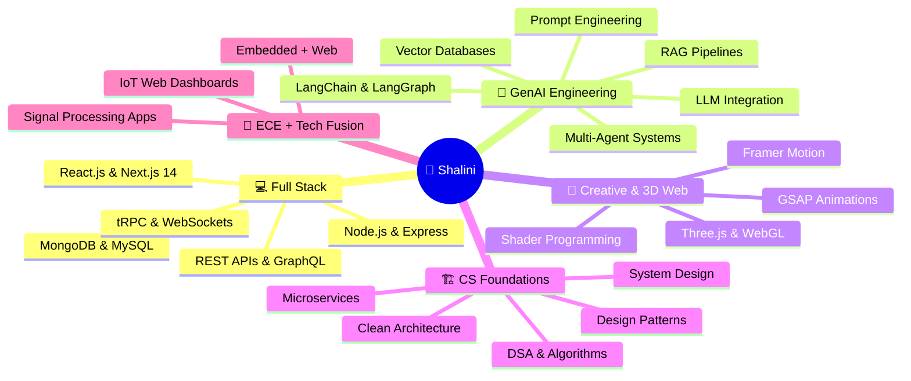

<div align="center">

<!-- TOP WAVE BANNER -->


<br/>

<!-- ANIMATED TYPING — MAIN ROLES -->
<a href="https://git.io/typing-svg">

</a>

<br/>

<!-- RUNNING TECH STACK — LEFT TO RIGHT SCROLL EFFECT -->


<br/><br/>

<!-- BADGE ROW 1 — Identity -->
<p>
  
  &nbsp;
  
  &nbsp;
  
  &nbsp;
  
</p>

<!-- BADGE ROW 2 — Tech Stack Quick View -->
<p>
  
  
  
  
  
  
  
  
  
  
  
  
</p>

<!-- BADGE ROW 3 - AI Stack -->
<p>
  
  
  
  
  
  
  
  
</p>

</div>

---

## 🌟 About Me


```yaml
╔══════════════════════════════════════════════╗
  👩‍💻  DEVELOPER PROFILE — SHALINI CHAURASIYA
╚══════════════════════════════════════════════╝

name         : Shalini Chaurasiya
pronouns     : She / Her
location     : Basti, Uttar Pradesh, India 🇮🇳
education    : B.Tech — Electronics & Communication Engg.
status       : 🟢 Actively building & open to opportunities

currently_building:
  🤖  InterviewAI.IQ   →  AI-Powered Mock Interview Platform
  🏥  MediTracker      →  AI-Driven Health Management System
  🛒  E-Commerce UI    →  React + Tailwind Responsive Storefront

skills_actively_growing:
  ⚡  MERN Stack     →  Full Stack Web Development
  🧠  Agentic AI     →  LLM Integration, LangChain, RAG
  🎨  Three.js       →  3D Web & WebGL Experiences
  🏗️  System Design  →  Scalable Architecture Patterns
  📊  DSA            →  Algorithms & Data Structures

core_values:
  💡  Curiosity first — always asking "why"
  🔁  Ship early, iterate fast, improve always
  🤝  Collaborate openly, grow together
  🎯  Build things that actually matter

fun_fact: "I love turning wild ideas into
          interactive digital reality ✨"
```

<br clear="right"/>

---

## 🔭 What I'm Up To

<table width="100%">
<tr>
<td width="50%" valign="top">

### 🚧 Currently Building
```
🤖  InterviewAI.IQ
    └── LLM-powered mock interview engine
    └── Real-time performance analytics
    └── Role-based question generation

🏥  MediTracker
    └── MERN + Python AI health agent
    └── Smart medication reminders
    └── Personalized health insights

🛒  E-Commerce Platform
    └── React + Tailwind storefront
    └── Cart & product management
    └── Fully responsive UI
```

</td>
<td width="50%" valign="top">

### 📚 Currently Learning
```
🧠  Agentic AI
    └── LangChain & LangGraph
    └── Multi-agent orchestration
    └── Tool-use & memory systems

🌐  Advanced Full Stack
    └── Next.js 14 App Router
    └── Server Components & RSC
    └── tRPC & GraphQL

🎨  3D Web Experiences
    └── Three.js fundamentals
    └── WebGL shaders
    └── Framer Motion animations
```

</td>
</tr>
</table>

---

## 🛠️ Tech Arsenal

<div align="center">

<!-- RUNNING SKILL SCROLL -->


<br/>

### 💻 Languages
<p>
  
</p>

### 🎨 Frontend Frameworks & Libraries
<p>
  
</p>

### ⚙️ Backend, Databases & Cloud
<p>
  
</p>

### 🔧 Tools, Platforms & DevOps
<p>
  
</p>

### 🤖 AI / GenAI Ecosystem
<p>
  
  
  
  
  
  
  
  
</p>

</div>

---

## 📈 Skills & Proficiency

```
⚡ JavaScript / TypeScript   ████████████████████░   90%
🎨 React.js                 ████████████████████░   88%
🖥️  Node.js & Express        ████████████████████░   85%
🗄️  MongoDB                  ███████████████████░░   82%
🐍 Python                   ████████████████░░░░░   75%
🤖 GenAI & LLM Integration  ████████████████░░░░░   75%
🎮 Three.js / WebGL          ████████████░░░░░░░░░   60%
🏗️  System Design             █████████████░░░░░░░░   65%
📊 Data Structures & Algo    ██████████████░░░░░░░   70%
🎨 UI/UX & Figma             ████████████████░░░░░   75%
```

---

## 🚀 Featured Projects

<div align="center">

<a href="https://github.com/Shalini-chaurasiya/InterviweAI.IQ">
  
</a>
<a href="https://github.com/Shalini-chaurasiya/MediTracker">
  
</a>

</div>

<br/>

### 🔹 Project 01 — InterviewAI.IQ
> **🎯 AI-Powered Mock Interview Platform — Transform how developers prep for tech interviews**

| 🔑 Feature | 📋 Description |
|---|---|
| 🤖 LLM Agent Engine | Dynamically generates questions based on role, tech stack & seniority level |
| 🎙️ Voice + Text Mode | Multi-modal interview simulation — speak or type your answers |
| 📊 Performance Analytics | Real-time scoring, gap analysis, improvement roadmap after every session |
| 🗂️ Interview Tracks | Frontend · Backend · DSA · System Design · Behavioral HR rounds |
| 📈 Progress Dashboard | Historical session trends, strength/weakness detection over time |
| 🔐 Auth System | JWT-based authentication with secure session management |

**Tech Stack:**
`React.js` `Node.js` `Express.js` `MongoDB` `OpenAI / Gemini APIs` `LLM Agents` `JWT Auth` `REST APIs` `Tailwind CSS`

---

### 🔹 Project 02 — MediTracker
> **🏥 AI-Powered Health Management — Your intelligent personal health companion**

| 🔑 Feature | 📋 Description |
|---|---|
| 💊 Medication Tracker | Smart medication schedule with dose history & adherence tracking |
| 🔔 Smart Reminders | Context-aware notification engine — never miss a dose |
| 🔍 AI Health Insights | Agent-driven health analysis & personalized daily recommendations |
| 📋 Digital Health Records | Organize prescriptions, reports, vitals in one place |
| 📊 Health Trend Charts | Visualize health patterns over weeks and months |

**Tech Stack:**
`MongoDB` `Express.js` `React.js` `Node.js` `Python` `AI Agent` `REST APIs` `Chart.js`

---

### 🔹 Project 03 — E-Commerce Platform
> **🛒 Modern, elegant shopping experience — React.js + Tailwind CSS**

| 🔑 Feature | 📋 Description |
|---|---|
| 🛍️ Product Catalog | Dynamic listing with filters, search & sorting |
| 🛒 Cart System | Persistent cart with quantity management & price summary |
| 📱 Responsive Design | Pixel-perfect layout across mobile, tablet & desktop |
| ⚡ Performance | Optimized with React hooks, lazy loading & memoization |

**Tech Stack:**
`React.js` `Tailwind CSS` `JavaScript` `React Hooks` `Context API`

---

## 📊 GitHub Analytics

<div align="center">


<br/><br/>


</div>

---

## 📈 Contribution Activity

<div align="center">
  
</div>

---

## 🏆 GitHub Trophies

<div align="center">
  
</div>

---

## 🗺️ Learning Roadmap



---

## 🎮 Beyond the Code

```yaml
when_not_coding:
  📖  Reading tech blogs & papers on AI research
  🎵  Listening to lo-fi while designing systems
  🧩  Solving DSA problems on LeetCode & GFG
  🌱  Exploring ECE + Software intersection projects
  ✍️  Writing notes on new tech I learn
  ☕  Brewing coffee and architecting side projects

currently_reading:
  - "Clean Code"                              — Robert C. Martin
  - "Designing Data-Intensive Applications"   — Martin Kleppmann
  - Latest papers on RAG & Agentic AI systems

goals_2025:
  ✅  Ship InterviewAI.IQ to production
  ✅  Contribute to open source projects
  ⬜  Build a Three.js interactive portfolio
  ⬜  Reach 100+ GitHub contributions this year
  ⬜  Land a great internship / full-time role
  ⬜  Publish a dev blog series on GenAI
```

---

## 💡 Developer Philosophy

<div align="center">

| 🧠 Think Deeply | 🔁 Iterate Fast | 🤝 Build Together | 📚 Learn Every Day |
|:---:|:---:|:---:|:---:|
| Design the architecture before writing line one | Ship early. Gather feedback. Improve continuously | Pair programming. Code reviews. Growing is a team sport | One new concept daily. Compound growth wins |

</div>

---

## 🤝 Let's Connect & Collaborate!

<div align="center">


<br/><br/>

<a href="https://www.linkedin.com/in/shalini-chaurasiya-03425931a/" target="_blank">
  
</a>
&nbsp;
<a href="mailto:shalinichaurasiya2203@gmail.com">
  
</a>
&nbsp;
<a href="https://github.com/Shalini-chaurasiya" target="_blank">
  
</a>

<br/><br/>

```
╔══════════════════════════════════════════════════════════════╗
║                                                              ║
║   💜  "First, solve the problem. Then, write the code."      ║
║                         — John Johnson                       ║
║                                                              ║
║   ✨  "Code is like humor. When you have to explain it,      ║
║         it's bad."    — Cory House                           ║
║                                                              ║
╚══════════════════════════════════════════════════════════════╝
```

<br/>


<br/><br/>


</div>

---


