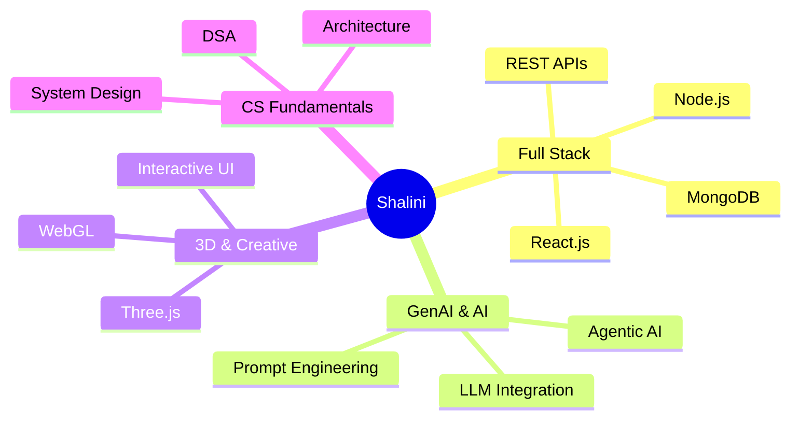

<div align="center">


<a href="https://git.io/typing-svg">

</a>

<br/>


</div>

---


## 🌟 About Me

```yaml
name       : Shalini Chaurasiya
location   : Lucknow, Uttar Pradesh 🇮🇳
education  : B.Tech — Electronics & Communication

building   :
  - 🤖 InterviewAI.IQ  (AI Mock Interview Platform)
  - 🏥 MediTracker     (AI Health Management)

learning   :
  - Full Stack MERN  |  Agentic AI  |  LLM Integration
  - Three.js  |  System Design  |  DSA

interests  : Web Dev · GenAI · Interactive Experiences
fun_fact   : "Ideas → Interactive Digital Reality ✨"
```

<br clear="right"/>

---

## 🛠️ Tech Arsenal

<div align="center">

**Languages & Frontend**


**Backend · Database · DevOps**


**Tools & Platforms**


</div>

---

## 🚀 Featured Projects

<div align="center">

<a href="https://github.com/Shalini-chaurasiya/InterviweAI.IQ">

</a>
<a href="https://github.com/Shalini-chaurasiya/MediTracker">

</a>

<a href="https://github.com/Shalini-chaurasiya/E-commerce-Wbsite-using-React.js-and-Tailwindcss">

</a>
<a href="https://github.com/Shalini-chaurasiya/AppointmentBook">

</a>

</div>

---

## 📊 GitHub Analytics

<div align="center">


<br/>


</div>

---

## 🐍 Contribution Snake

> _The snake animation below is auto-generated by a GitHub Action. Set it up once and it runs forever!_

<div align="center">

<picture>
  <source media="(prefers-color-scheme: dark)" srcset="https://raw.githubusercontent.com/Shalini-chaurasiya/Shalini-chaurasiya/output/github-contribution-grid-snake-dark.svg">
  <source media="(prefers-color-scheme: light)" srcset="https://raw.githubusercontent.com/Shalini-chaurasiya/Shalini-chaurasiya/output/github-contribution-grid-snake.svg">
  
</picture>

</div>

---

## 📈 Contribution Graph

<div align="center">

</div>

---

## 🏆 GitHub Trophies

<div align="center">

</div>

---

## 🎯 What I'm Focused On



---

## 🤝 Let's Connect!

<div align="center">

<a href="https://www.linkedin.com/in/shalini-chaurasiya-03425931a/">

</a>
&nbsp;
<a href="mailto:shalinichaurasiya2203@gmail.com">

</a>
&nbsp;
<a href="https://github.com/Shalini-chaurasiya">

</a>

<br/><br/>


<br/><br/>

### 💜 Thanks for visiting! Let's build something amazing together.


<br/>


</div>
