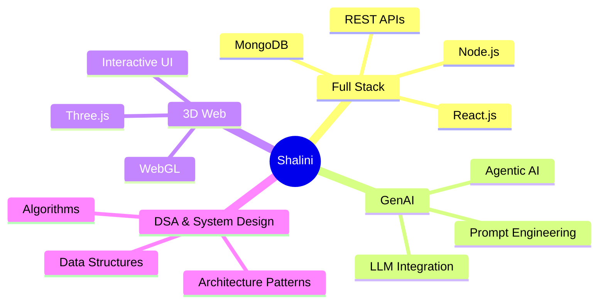

<div align="center">

<!-- Animated Header Banner -->


<!-- Typing SVG -->
<a href="https://git.io/typing-svg">
  
</a>

<br/>

<!-- Profile Views & Followers Badges -->
<p>
  
  
  
</p>

</div>

---

<!-- About Section with animated side graphic -->


## 🌟 About Me

```yaml
name: Shalini Chaurasiya
located_in: Lucknow, Uttar Pradesh, India 🇮🇳
education: B.Tech in Electronics & Communication Engineering
status: Actively building & learning

currently_working_on:
  - 🤖 AI Interview Platform (InterviewAI.IQ)
  - 🏥 MediTracker - AI-powered health management

learning:
  - Full Stack Development (MERN)
  - Agentic AI & LLM Integration
  - Three.js & 3D Web Experiences
  - System Design & DSA

passions:
  - Web Development
  - Generative AI
  - Interactive Digital Experiences
  - Problem Solving

fun_fact: "I love turning wild ideas into
          interactive digital reality ✨"
```

<br clear="right"/>

---

## 🛠️ Tech Arsenal

<div align="center">

### 💻 Languages & Frontend
<p>
  
</p>

### ⚙️ Backend, Database & DevOps
<p>
  
</p>

### 🔧 Tools & Platforms
<p>
  
</p>

</div>

---

## 🚀 Featured Projects

<div align="center">

<a href="https://github.com/Shalini-chaurasiya/InterviweAI.IQ">
  
</a>
<a href="https://github.com/Shalini-chaurasiya/MediTracker">
  
</a>

</div>

<br/>

### 🔹 InterviewAI.IQ — *AI-Powered Mock Interview Platform*
> **Transform how you prepare for technical interviews**

```
📌 AI-based mock interview system with real-time feedback & performance analytics
🤖 Powered by LLM agents for dynamic question generation
📊 Detailed performance analysis with actionable insights
🎯 Role-specific interview tracks (Frontend, Backend, DSA, System Design)
```
**Stack:** `React.js` `Node.js` `Express` `MongoDB` `GenAI APIs` `LLM Agents`

---

### 🔹 MediTracker — *AI-Powered Health Management*
> **Smart healthcare at your fingertips**

```
🏥 Full-stack MERN project with integrated AI agent
💊 Medication tracking & reminder system
🔍 AI-driven health insights & recommendations
```
**Stack:** `MERN` `Python` `AI Agent` `REST APIs`

---

### 🔹 E-Commerce Platform — *React.js & Tailwind CSS*
> **Modern shopping experience with elegant UI**

```
🛒 Full-featured e-commerce UI with cart & product management
📱 Fully responsive across all devices
⚡ Optimized performance with React hooks
```
**Stack:** `React.js` `Tailwind CSS` `JavaScript`

---

## 📊 GitHub Analytics

<div align="center">


<br/>


</div>

---

## 🐍 Contribution Snake

<div align="center">

<picture>
  <source media="(prefers-color-scheme: dark)" srcset="https://raw.githubusercontent.com/Shalini-chaurasiya/Shalini-chaurasiya/output/github-contribution-grid-snake-dark.svg">
  <source media="(prefers-color-scheme: light)" srcset="https://raw.githubusercontent.com/Shalini-chaurasiya/Shalini-chaurasiya/output/github-contribution-grid-snake.svg">
  
</picture>

</div>

---

## 📈 Contribution Graph

<div align="center">
  
</div>

---

## 🏆 GitHub Trophies

<div align="center">
  
</div>

---

## 🎯 Current Focus



---

## 🤝 Let's Connect & Collaborate!

<div align="center">

<a href="https://www.linkedin.com/in/shalini-chaurasiya-03425931a/" target="_blank">
  
</a>
&nbsp;
<a href="mailto:shalinichaurasiya2203@gmail.com">
  
</a>
&nbsp;
<a href="https://github.com/Shalini-chaurasiya" target="_blank">
  
</a>

<br/><br/>


</div>

---

<div align="center">

### 💜 Thanks for visiting! Let's build something amazing together.


*"Code is like humor. When you have to explain it, it's bad."*

<br/>

<!-- Footer Wave -->


</div>
