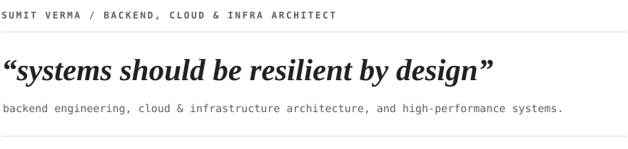
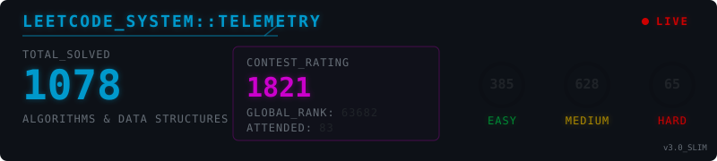

  

  &nbsp;
  &nbsp;
  

 

  

 

  <picture>
    <source media="(prefers-color-scheme: dark)" srcset="contribution-history-dark.svg">
    <source media="(prefers-color-scheme: light)" srcset="contribution-history-light.svg">
    
  </picture>

<!-- GITHUB_STATS:START -->

  <picture>
    <source media="(prefers-color-scheme: dark)" srcset="github-stats-dark.svg">
    <source media="(prefers-color-scheme: light)" srcset="github-stats-light.svg">
    
  </picture>

  <picture>
    <source media="(prefers-color-scheme: dark)" srcset="leetcode-stats-dark.svg">
    <source media="(prefers-color-scheme: light)" srcset="leetcode-stats-light.svg">
    
  </picture>

<!-- GITHUB_STATS:END -->

---

  <strong>Connect with me</strong> 
  GitHub: <a href="https://github.com/Shalini-chaurasiya">github.com/Shalini-chaurasiya</a> ·
  LinkedIn: <a href="https://www.linkedin.com/in/shalini-chaurasiya-03425931a/">linkedin.com/in/shalini-chaurasiya-03425931a</a> ·
  LeetCode: <a href="https://leetcode.com/u/shaliiiiiiiniiiichhh123">leetcode.com/u/shaliiiiiiiniiiichhh123</a> 
  Codeforces: <a href="https://codeforces.com/profile/Shalini_chaurasiya">codeforces.com/profile/Shalini_chaurasiya</a> ·
  CodeChef: <a href="https://www.codechef.com/users/shalini_ch123">codechef.com/users/shalini_ch123</a> ·
  Email: <a href="mailto:shalinichaurasiya2203@gmail.com">shalinichaurasiya2203@gmail.com</a>

  🐼 Auto-updated by <a href=".github/workflows/update-readme.yml">NeonPanda</a>

